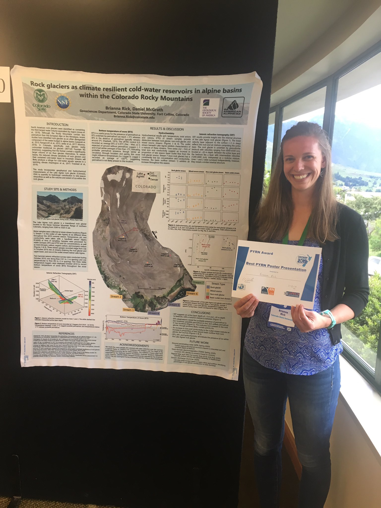

[Home](https://briannarick.github.io/home) | [CV](../cv/cv.html) | [Publications](../publications/pubs.html) | [Research](../research/research.html) | [Teaching](../teaching/teaching.html) | DataViz

# Data Visualization Projects

Here's a little intro to the types of data visualization you like to do

## Products
Click on the image to see the full visualization

  
   
   
   
   
      
   
   
     
  

