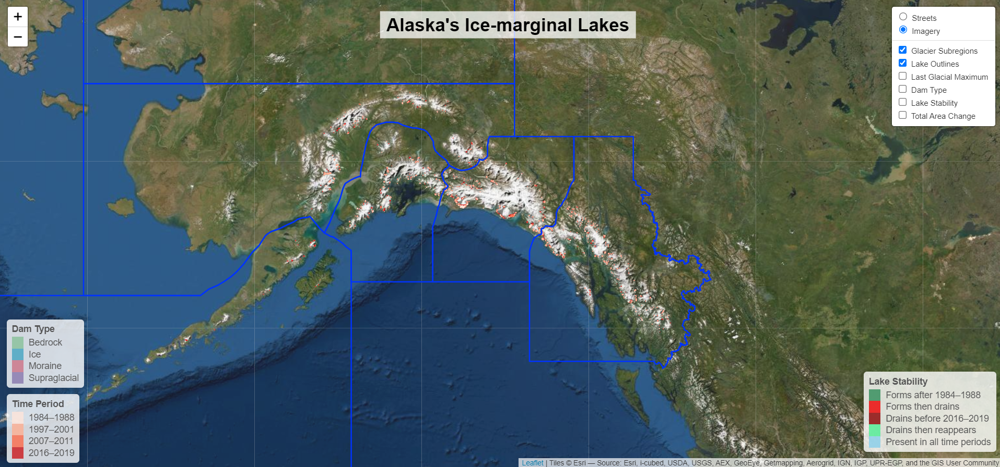
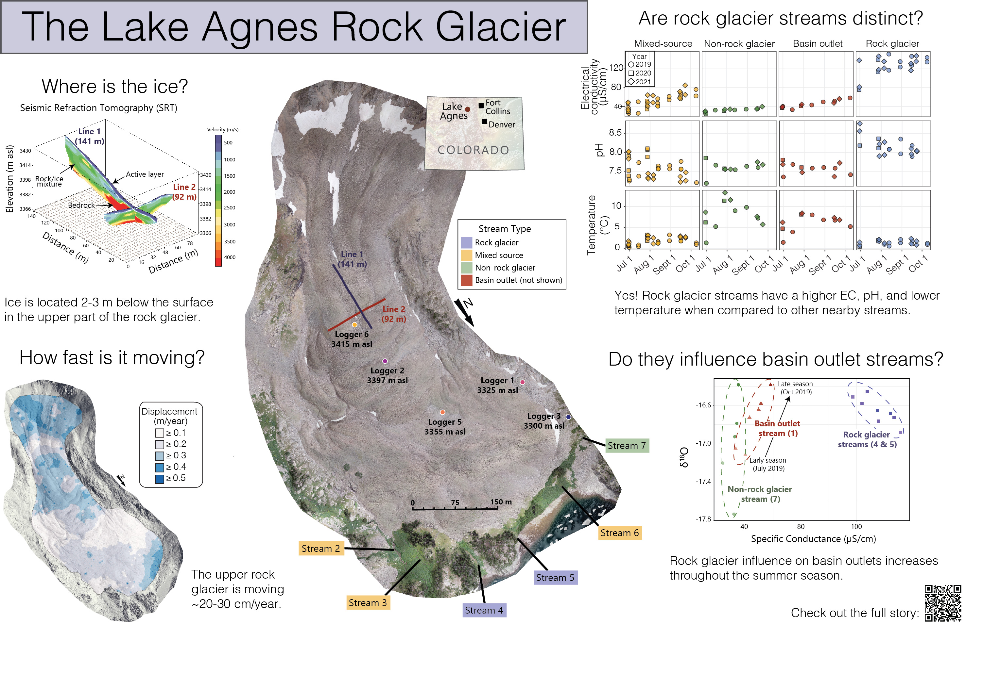
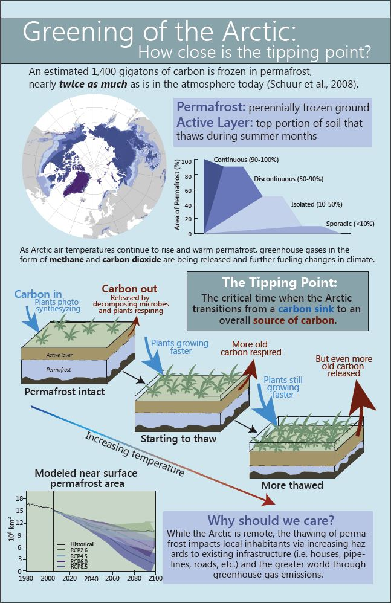
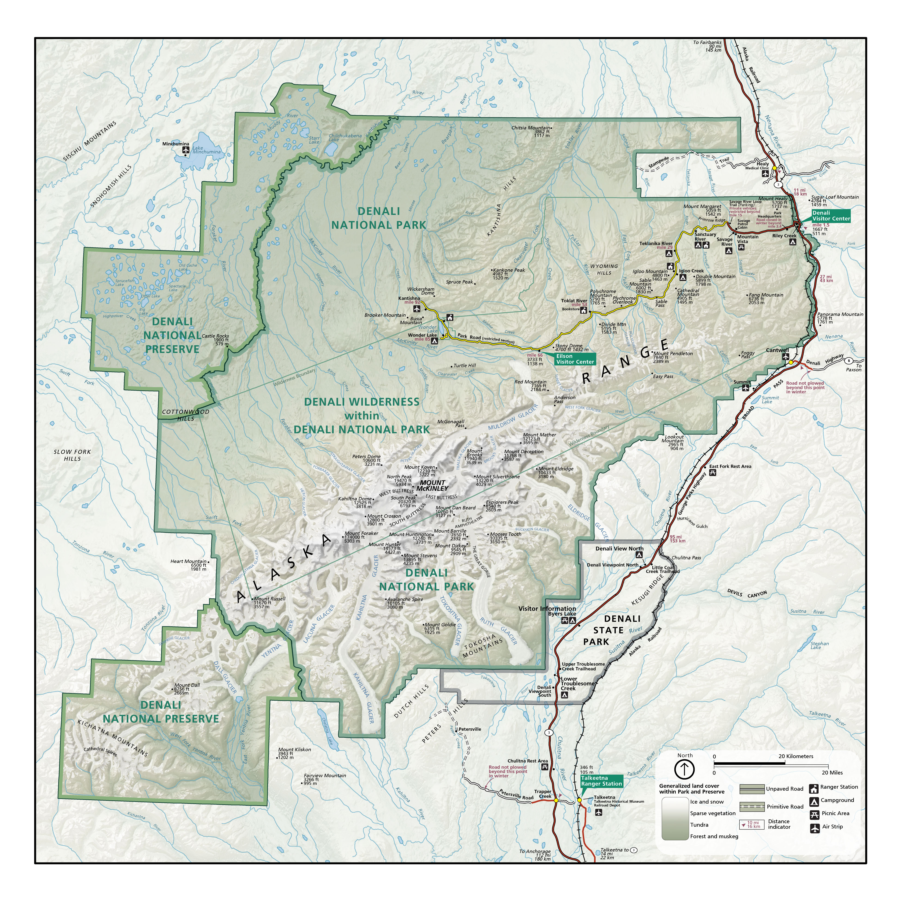
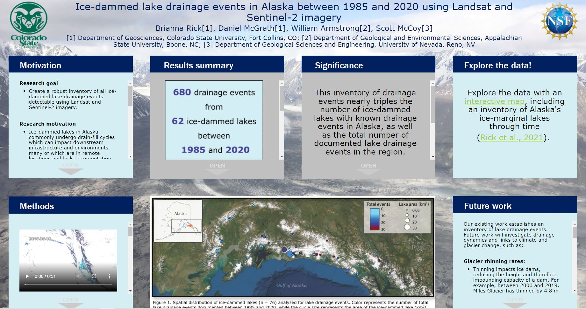

[Home](https://briannarick.github.io) | [CV](../cv/cv.html) | [Publications](../publications/pubs.html) | [Research](../research/research.html) | DataViz

# Data Visualization Projects

Data visualizations are an important tool to broaden the reach of scientific research. My goal is to tailor my products to the intended audience, whether that be a specialized community of researchers at a scientific conference, or the general public who might have little exposure to the subject. 

My workflows integrate across platforms, including RStudio, ArcGIS, and Adobe Illustrator to create static and interactive visuals to display spatial and temporal data. 

## Products
<em>Click on the image to see the full visualization</em>

  
   
      
    
    
    
   
    
   </a>
    
 
  

