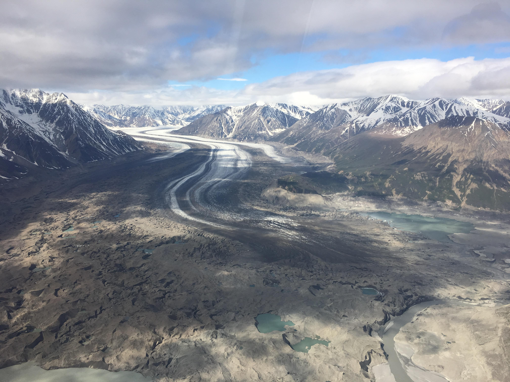
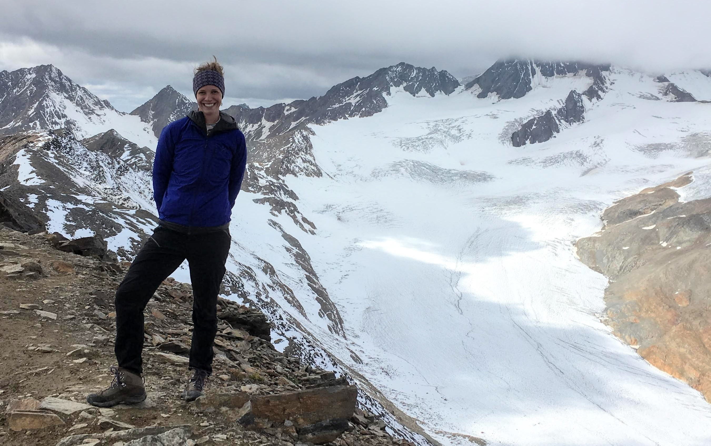

---
output:
  html_document:
    css: air.css
    vss: air.css
---

Home | [CV](cv/cv.html) | [Publications](publications/pubs.html) | [Research](research/research.html) | [DataViz](dataviz/dataviz.html)

# Brianna Rick
## PhD Candidate, Department of Geosciences   Colorado State University

I am a cryospheric scientist, broadly looking at how climate change is impacting Arctic and alpine environments. 

Over the past century, Arctic and alpine environments have warmed nearly twice as fast as the global average, leading to pronounced physical and ecological changes. Some of the most significant and visible changes have occurred in the cryosphere, including the loss of Arctic sea ice, mass losses from mountain glaciers, and widespread permafrost degradation.  While these environments are often far removed, the magnitude and rate of these changes have profound impacts at local to global scales. Ice is a key, and highly sensitive, component to the structural integrity of many landforms in these environments (i.e. glaciers, permafrost, moraines), and thus warming temperatures have decreased their stability. Natural hazards resulting from this decreased stability are considered “cryo-geohazards” and include landslides, debris flows, rock slides, and glacial lake outburst floods (GLOFs). My research explores the continuum of cryo-geohazards within the US and their potential impacts, including GLOFs in Alaska and the hydrologic role of rock glaciers in Colorado.

</img> 
</img> 
</img>

 

Contact me:  
Brianna Rick  
[brianna.rick [at] colostate.edu](mailto:brianna.rick@colostate.edu)

