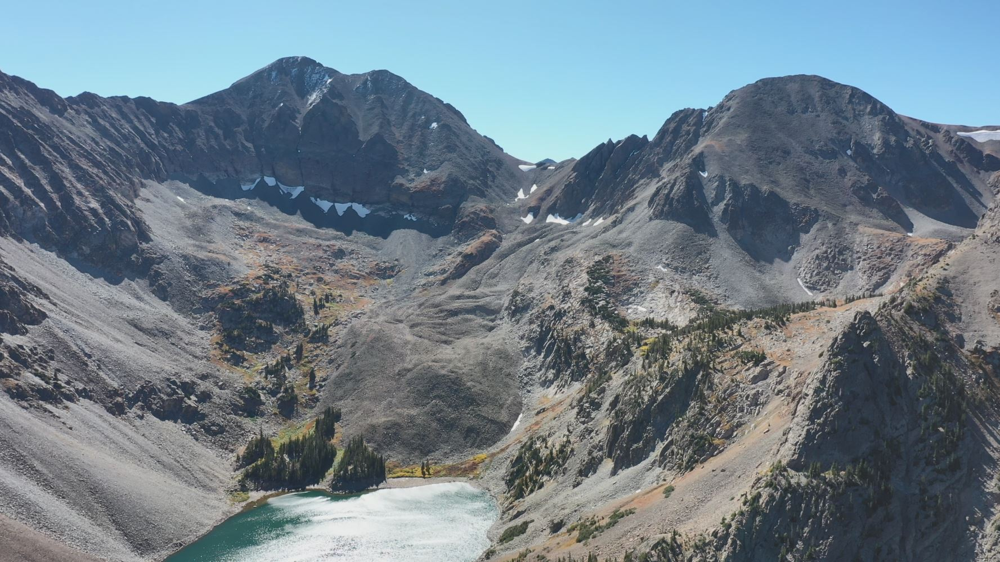

---
output:
  html_document:
    css: ~/brick7.github.iov3/air.css
    vss: ../air.css
---

[Home](https://briannarick.github.io) | [CV](../cv/cv.html) | [Publications](../publications/pubs.html) | Research | [DataViz](../dataviz/dataviz.html)

# About my research

## Alaska's glacial lakes and outburst floods

Glacial lake outburst floods (or GLOFs) occur when a glacial lake dam (such as a moraine) fails or is overtopped, suddenly releasing a large volume of water. These floods can have massive impacts on downstream ecosystems, infrastructure, and communities. GLOFs can destroy infrastructure and cause the loss of human lives in mountain communities. Understanding how these lakes are changing as glaciers thin and retreat is a critical first step in assessing the hazard potential of individual lakes, and eventually formulating hazard mitigation strategies for local communities. As part of my Ph.D. research, I use novel remote sensing tools, such as the cloud-based Google Earth Engine, to process large datasets to <a href="AKmapNov152021.html">map the evolution of glacial lakes</a> in Alaska over the past 40 years. Using this dataset, I also document lake drainage events, which contribute to our understanding of evolving lake hazards in a changing climate.

</img> 

 

## The Lake Agnes Rock Glacier

I investigate the Lake Agnes rock glacier as a case study to better understand how active rock glaciers within the Front Range act as climate resilient cold-water reservoirs. In Colorado, rock glaciers outnumber traditional ice glaciers and cover a larger spatial extent, suggesting that they contain a larger volume of ice than glaciers themselves. In certain basins, the reduced climate sensitivity of rock glaciers (due to a thick debris cover) and their consistent cold-water input to mountain streams will likely provide a refuge for cold-water species in a warming climate. For this research, I use a combination of geophysics (e.g. seismic refraction, ground-penetrating radar), remote sensing (e.g. Structure from Motion, lidar), and hydrochemical analysis (e.g. isotopes, ion chromatography) to better understand the ice content, movement, and water supply of the Lake Agnes rock glacier.

</img> 

 
